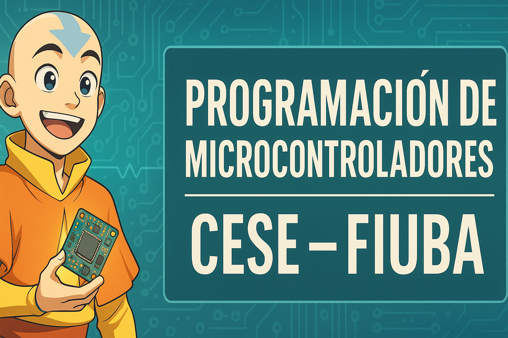

# Programación de microcontroladores (CESE · FIUBA)

  

Repo de referencia para prácticas de **Programación de microcontroladores** (CESE · FIUBA) usando **STM32 NUCLEO**.

## Requisitos

### Software
- **STM32CubeIDE**

### Hardware
- Placa de desarrollo STM **NUCLEO-F446RE** correspondiente a la familia (`stm32f4xx`).

## 📂 Organización del Repositorio

📁 pdm
├── 📁 assets
├── 📁 practica_0_template
├── 📁 practicas
│   ├── 📁 practica_1
│   │   ├── 📁 Core
│   │   │   ├── 📁 inc
│   │   │   │    └── main.h
│   │   │   └── 📁 src
│   │   │        └── main.c
│   │   └── 📁 Drivers
│   │           ├── 📁 CMSIS
│   │           ├── 📁 STM32F4xx_HAL_Driver
│   └── 📁 practica_2
│   │   ├── 📁 Core
│   │   │   ├── 📁 inc
│   │   │   │    └── main.h
│   │   │   └── 📁 src
│   │   │        └── main.c
│   │   └── 📁 Drivers
│   │           ├── 📁 CMSIS
│   │           ├── 📁 STM32F4xx_HAL_Driver
├── 📁 stm32f429zi
├── .gitignore
└── README.md